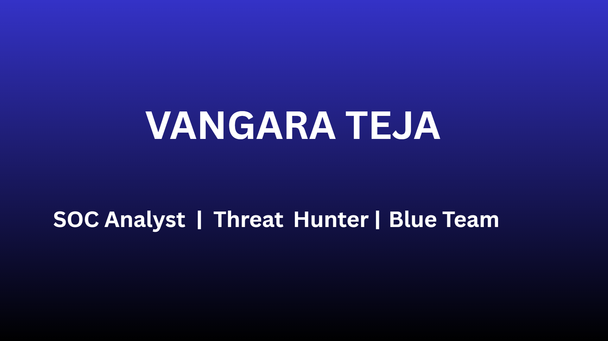

  

Hi 👋 I'm Teja Venkata Ramakrishna

## SOC Analyst | Threat Hunter | Digital Forensics | Blue Team

Cybersecurity enthusiast passionate about Security Operations, Incident Response, Threat Hunting, and Digital Forensics.

---

## 🚀 About Me

- 🔭 Currently building cybersecurity projects
- 🌱 Learning Detection Engineering
- 💻 Python & Bash Automation
- 🛡️ Blue Team Enthusiast
- 📍 India

---
## 🛡️ Core Competencies

 

| Domain | Skills |
|--------|--------|
| **Security Operations** | Alert triage · Incident workflow · SOC tooling · Analyst dashboards |
| **Detection Engineering** | Sigma rules · Detection logic · Alert tuning · Rule correlation |
| **SIEM & Log Analysis** | Splunk · Log ingestion · Pipeline design · Event correlation |
| **Windows Telemetry** | Sysmon · Windows Event Logs · Event ID mapping · WEF |
| **Threat Hunting** | Hypothesis-driven hunting · IOC analysis · Behavioral detection |
| **Incident Response** | Dossier generation · Timeline reconstruction · Triage workflows |
| **Adversary Simulation** | Attack emulation · Red-vs-blue · MITRE ATT&CK mapping |
| **Automation & Tooling** | Python · PowerShell · Bash · Security scripting |

 

---
## ⚙️ Tech Stack

 

**Languages**

**Security Tooling**

**Frameworks & Data**

**Frameworks & Methodologies**

 

---

 

## 🛠️ Skills

### SIEM
- Splunk
- ELK Stack

### Security
- Threat Hunting
- Incident Response
- Digital Forensics
- MITRE ATT&CK
- IOC Analysis
- OSINT

### Networking
- TCP/IP
- DNS
- HTTP
- SMTP

### Tools
- Wireshark
- Nmap
- Nessus
- Snort

### Languages
- Python
- Bash

---
## 🤝 Open To

 

 
